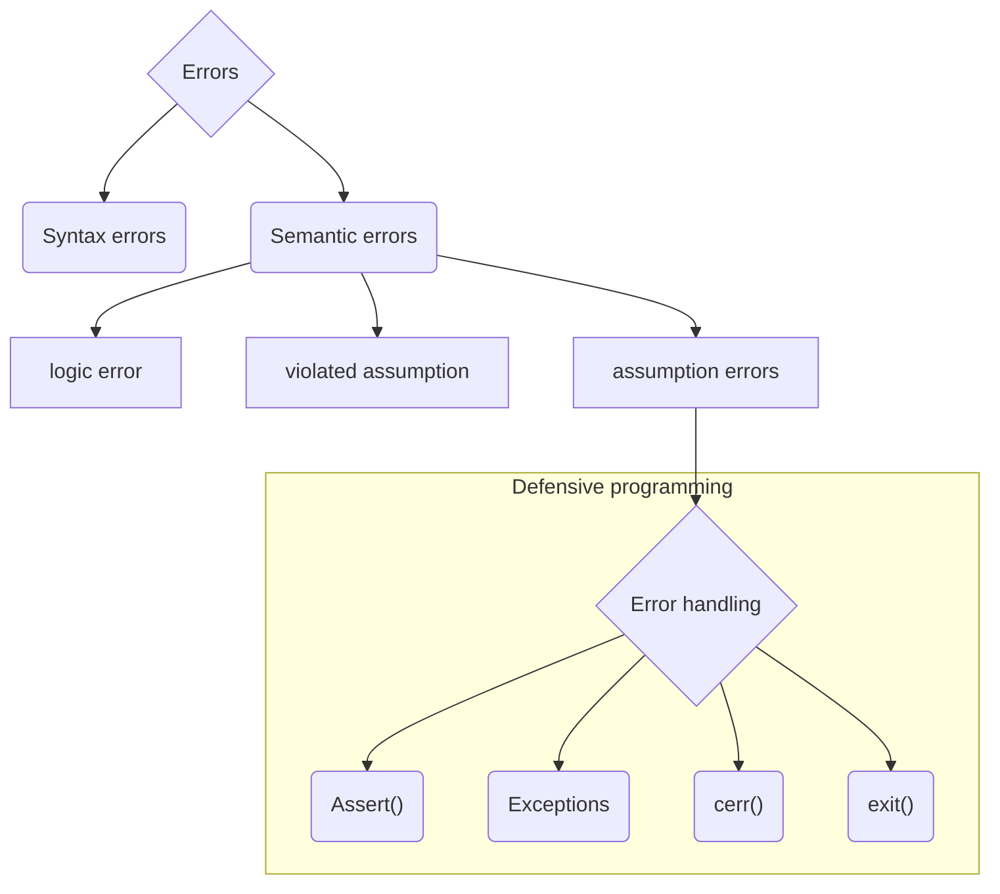

# Chapter19: Error handling
## Motivation

```mermaid
graph TD
    B{Errors}
    B --> C(Syntax errors)
    B --> D(Semantic errors)
    D --> E[logic error]
    D --> F[violated assumption]
    D --> G[assumption errors]
    G --> H{Error handling}
    H --> I("Assert()")
    H --> J(Exceptions)
    H --> K("cerr()")
    H --> L("exit()")
    subgraph Defensive programming
    H
    I
    J
    K
    L
    end
```
